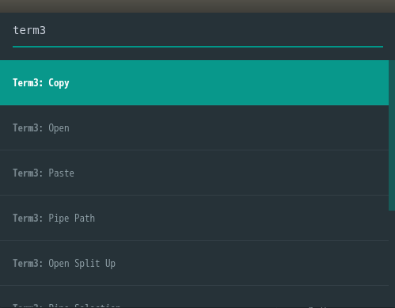
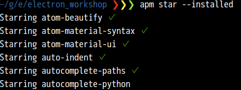

# electron_workshop

## このワークショップのゴール
+ (Atomエディタ, nodejs・npm, Electron)ちょっとわかるマンになる
+ Electronアプリ作るマンになる

## 進め方
### 1. 環境構築
#### Atomエディタのインストール
今回利用するエディタは[Atom](https://www.youtube.com/watch?v=Y7aEiVwBAdk#action=share&cc_load_policy=1)です。理由は、AtomがElectronアプリだからです。
Atomを使っていくうちに、

  + Electronアプリにどんな特徴があるか
  + npm(apm)がいかに便利か✨

がわかります！

[公式サイト](https://atom.io/)から(インストーラ|パッケージファイル)をダウンロードしてインストールしてください。

できましたか？次に、Atomをカスタマイズして使いやすくしてみましょう。
##### Atomパッケージのインストール
Atomでは、パッケージ(プラグイン的なもの)をインストールして機能を拡張したり、外見を変えたりできます。今回は以下のパッケージを試してみましょう。

+ atom-beautify (コード整形)
+ file-icons (ファイルタイプがわかりやすくなるアイコン表示)
+ japanese-menu (メニューの日本語化)
+ minimap
+ minimap-find-and-replace(検索・置換でminimapでもハイライト)
+ term3 (エディタ内で動くターミナルエミュ)
+ atom-material-syntax(人気のあるシンタックスデザイン)
+ atom-material-ui(人気のあるUIデザイン)

パッケージの検索・インストールはエディタ内の設定画面からできますが、入れるパッケージが決まっているので今回はターミナルからやってみましょう。ターミナルを起動して以下のコマンドを入力してください。
````
apm install atom-beautify file-icons japanese-menu minimap minimap-find-and-replace term3 atom-material-syntax atom-material-ui
````
Atomを初めて使った方は、apmってなんだよ(哲学)と思われたでしょう。apmはのAtom向けのnpmのようなものです。Atomをインストールすると付いてきます。apm自身もnodejsのパッケージなので、npmでインストール可能です。そもそもnodejsって何だ、npmって何だという方は、このあとわかるようになるので一旦忘れてください。

さて、エディタはいい感じになったと思います。しかし、例えば明日学校・職場のPCでコードを書くとき、この環境を同じ手順で再現するのは面倒です。そこでapmの出番です、さきほどターミナルエミュレータのパッケージを入れたのでそこから使ってみましょう。

"Ctrl-Shift-P"(OS Xの方は以降ctrlをcmdに読み替えてください)を入力してください。そして"term3"と入力してEnterで、ターミナルエミュレータが起動します。

"Ctrl-Shift-P"で出てくるウインドウはコマンドパレットと言って、このように検索を利用してキーバインドを覚えることなく任意の機能を実行できます。便利！


ターミナルに以下のコマンドを入力してください。
````
apm star --installed
````
すると、atom.ioの自分のアカウントのAPIトークンを求められます。Enterするとatom.ioのページに飛ぶので、トークンを入手してターミナルに貼り付けてください。コマンドが実行されます。



これで、インストール済みのパッケージが「お気に入りに追加」されたことになります。他の環境でAtomを利用することになったら、
````
apm stars --install
````
を実行すると、なんとstarしたパッケージが全てインストールされます！便利！！

##### エディタ設定の変更
もう少しでコード書けるのでしばらく付き合ってください。仕上げにエディタのフォントサイズを変更します。普通のエディタでは、ヘッダ,フッタ,ディレクトリツリー部分など、各部ごとに細かく設定することは難しいです。が、Atomはelectronアプリなので可能です。

"Ctrl-Shift-P"でコマンドパレットを開き、"settings"と入力してEnterしてください。設定画面が開かれます。設定画面の「設定フォルダを開く」をクリックしてください。新規ウィンドウで設定フォルダが開かれるので、フォルダ内のstyles.lessを開いてください。

styles.lessに以下を記述して保存してください。
````
.tree-view {
  font-size: 16px;
}
atom-workspace {
  font-size: 18px;
}
````
ディレクトリツリーと設定画面のフォントサイズがそれぞれ変更されたと思います。

さて、この記法ですが、もろcssのそれですね。Atomはフォントサイズ以外にもフォントカラー,配置(padding, margin),アニメーションなど、cssを記述することで自由にカスタマイズできます。

先ほどインストールしたパッケージもjavascript(coffescript)などで記述されています(例えば、style.lessの入っていた設定フォルダ/packages/atom-beautify/srcを見てみてください)。そして先ほどわかったように、それらはapmというnpmのようなシステムで管理されています。

そう、Electron AppはWeb技術を使ってつくるデスクトップアプリなんです。開発の準備はバッチシ、さっそく作ってみましょう。

### 2. とにかくElecron Appをつくってうごかす
