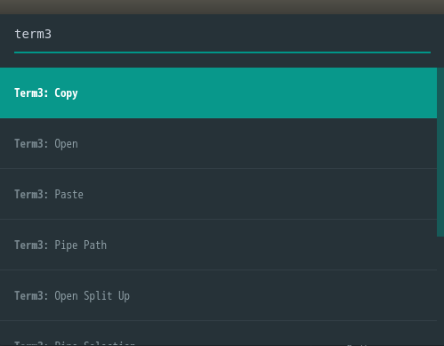
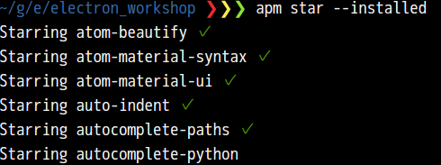
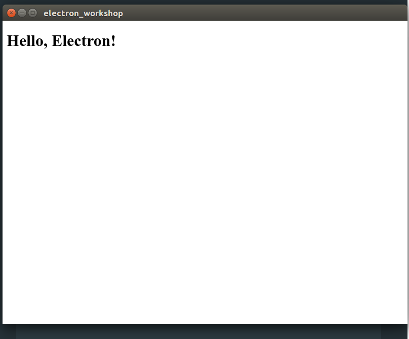

# electron_workshop

## このワークショップのゴール
+ (Atomエディタ, nodejs・npm, Electron)ちょっとわかるマンになる
+ Electronアプリ作るマンになる

## 進め方
### 1. 環境構築
#### Atomエディタのインストール
今回利用するエディタは[Atom](https://www.youtube.com/watch?v=Y7aEiVwBAdk#action=share&cc_load_policy=1)です。理由は、AtomがElectronアプリだからです。
Atomを使っていくうちに、

  + Electronアプリにどんな特徴があるか
  + npm(apm)がいかに便利か✨

がわかります！

[公式サイト](https://atom.io/)から(インストーラ|パッケージファイル)をダウンロードしてインストールしてください。

できましたか？次に、Atomをカスタマイズして使いやすくしてみましょう。
##### Atomパッケージのインストール
Atomでは、パッケージ(プラグイン的なもの)をインストールして機能を拡張したり、外見を変えたりできます。今回は以下のパッケージを試してみましょう。

+ atom-beautify (コード整形)
+ file-icons (ファイルタイプがわかりやすくなるアイコン表示)
+ japanese-menu (メニューの日本語化)
+ minimap
+ minimap-find-and-replace(検索・置換でminimapでもハイライト)
+ term3 (エディタ内で動くターミナルエミュ)
+ atom-material-syntax(人気のあるシンタックスデザイン)
+ atom-material-ui(人気のあるUIデザイン)

パッケージの検索・インストールはエディタ内の設定画面からできますが、入れるパッケージが決まっているので今回はターミナルからやってみましょう。ターミナルを起動して以下のコマンドを入力してください。
````
apm install atom-beautify file-icons japanese-menu minimap minimap-find-and-replace term3 atom-material-syntax atom-material-ui
````
Atomを初めて使った方は、apmってなんだよ(哲学)と思われたでしょう。apmはのAtom向けのnpmのようなものです。Atomをインストールすると付いてきます。apm自身もnodejsのパッケージなので、npmでインストール可能です。そもそもnodejsって何だ、npmって何だという方は、このあとわかるようになるので一旦忘れてください。

さて、エディタはいい感じになったと思います。しかし、例えば明日学校・職場のPCでコードを書くとき、この環境を同じ手順で再現するのは面倒です。そこでapmの出番です、さきほどターミナルエミュレータのパッケージを入れたのでそこから使ってみましょう。

`Ctrl-Shift-P`(OS Xの方は以降ctrlをcmdに読み替えてください)を入力してください。そして`term3`と入力して`Enter`で、ターミナルエミュレータが起動します。

`Ctrl-Shift-P`で出てくるウインドウはコマンドパレットと言って、このように検索を利用してキーバインドを覚えることなく任意の機能を実行できます。便利！



ターミナルに以下のコマンドを入力してください。
````
apm star --installed
````
すると、atom.ioの自分のアカウントのAPIトークンを求められます。Enterするとatom.ioのページに飛ぶので、トークンを入手してターミナルに貼り付けてください。コマンドが実行されます。



これで、インストール済みのパッケージが「お気に入りに追加」されたことになります。他の環境でAtomを利用することになったら、
````
apm stars --install
````
を実行すると、なんとstarしたパッケージが全てインストールされます！便利！！

##### エディタ設定の変更
もう少しでコード書けるのでしばらく付き合ってください。仕上げにエディタのフォントサイズを変更します。普通のエディタでは、ヘッダ,フッタ,ディレクトリツリー部分など、各部ごとに細かく設定することは難しいです。が、Atomはelectronアプリなので可能です。

`Ctrl-Shift-P`でコマンドパレットを開き、`settings`と入力してEnterしてください。設定画面が開かれます。設定画面の「設定フォルダを開く」をクリックしてください。新規ウィンドウで設定フォルダが開かれるので、フォルダ内の`styles.less`を開いてください。

`styles.less`に以下を記述して保存してください。
````
.tree-view {
  font-size: 16px;
}
atom-workspace {
  font-size: 18px;
}
````
ディレクトリツリーと設定画面のフォントサイズがそれぞれ変更されたと思います。

さて、この記法ですが、もろcssのそれですね。Atomはフォントサイズ以外にもフォントカラー,配置(padding, marginなど),アニメーションなど、cssを記述することで自由にカスタマイズできます。

先ほどインストールしたパッケージたちはjavascript(coffescript)などで記述されています(例えば、style.lessの入っていた設定フォルダ/packages/atom-beautify/srcを見てみてください)。そして先ほどわかったように、それらはapmというnpmのようなシステムで管理されています。

そう、Electron AppはWeb技術を使ってつくるデスクトップアプリなんです。開発の準備はもうバッチシ、さっそく作ってみましょう。

### 2. とにかくElecron Appをつくってうごかす
Hello, Worldしてみましょう。(エディタ内)ターミナルで以下のコマンドを入力してください。
````
mkdir hello_electron && cd hello_electron
````
ここをアプリケーションのルートディレクトリとします。


続けて以下を入力してください。
````
npm init -y
ls
````
`npm init`によって`package.json`が作られたことがわかります。
npmによって管理できるパッケージの最小構成ができたことになります。package.jsonを開いてみてください。パッケージについての情報が書かれています。自分が作ったアプリを公開する際、依存している(利用している)外部のパッケージやインストール・実行時のコマンドを書いておくことで、ユーザは利用しやすくなるんです。

例えば`package.json`に
+ `"dependencies"`というフィールド上を追加して、必要なパッケージを書いておく
+ `"scripts": { "start": "実行用コマンド" }`と書いておく

ことで、ユーザは
````
git clone "リポジトリのURL"
cd "リポジトリ名"
npm install
npm start
````
とするだけでアプリをインストール・実行できるわけです！npmをご存じなかった方も、その威力をわかっていただけるのではと思います

ではでは、お待ちかねのコーディングです。`package.json`と同じ階層に`index.js`を作成して以下のように編集してください。

````
'use strict'; // strictモードを使用(https://developer.mozilla.org/ja/docs/Web/JavaScript/Strict_mode)

let BrowserWindow; // ウインドウオブジェクトはグローバル参照しておく

// electronやウインドウのインスタンスを生成
var electron = require('electron');
var app = electron.app;
BrowserWindow = electron.BrowserWindow;

var mainWindow = null;

// ウインドウが全て閉じられた時のイベント
app.on('window-all-closed', function() {
  if (process.platform != 'darwin')
    app.quit();
});

// Electronが初期化され、ウインドウを作成可能になった時のイベント
app.on('ready', function() {

  // Chromiumの起動, 初期画面のロード
  mainWindow = new BrowserWindow({width: 800, height: 600});
  mainWindow.loadURL('file://' + __dirname + '/index.html');

  // ウインドウが閉じられた時のイベント
  mainWindow.on('closed', function() {
    mainWindow = null;
  });
});
````
続けて、index.htmlを同じ場所に作って以下のように編集してください。
````
<!DOCTYPE html>
<html>

<head>
  <meta charset="UTF-8">
  <title>electron_workshop</title>
</head>

<body>
  <h1>Hello, Electron!</h1>
</body>

</html>
````
javascriptとHTMLのファイルを追加しました。それぞれアプリケーションの動作と表示画面を定義しています。早速動かしてみましょう。

まずelectronをインストールします。ターミナルで以下を入力してください。
````
npm install electron-prebuilt -g
electron -v
````
electronのバージョンが表示されたら、作ったアプリを起動してみます。
````
electron .
````
こんな画面が表示されましたか…？




### 3. ちょっと凝ったElecron Appをつくる
